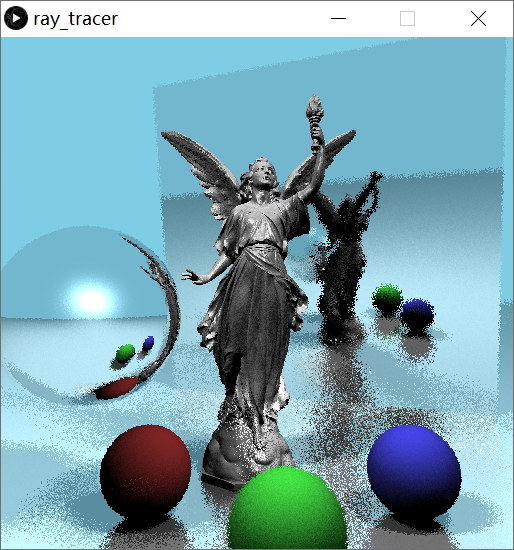
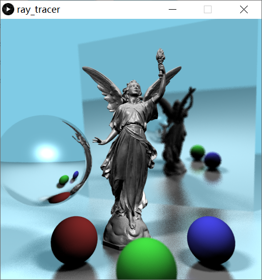
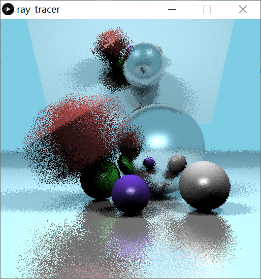
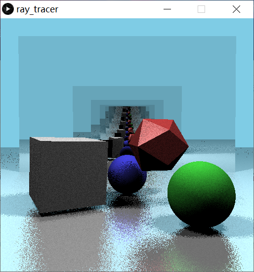
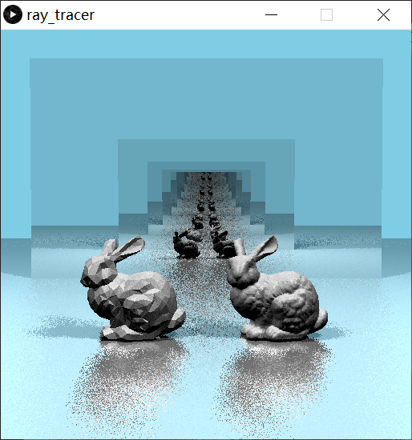
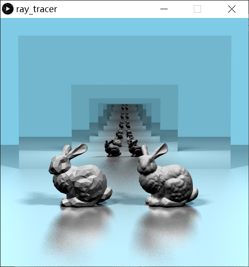

# Ray Tracer
A classical ray tracing renderer implementation from scratch in Processing. Written in Java.

## Image Outputs
|Fast Render|Quality Render|
|---|---|
|||
|||
|||
|||

## How to run
1. Install [Processing](https://processing.org/).
2. Clone or Download the codebase.
3. Double click on ray_tracer.pde.
4. Click the run button on the top left of the Processing interface.

## Controls
Press number keys `1` to `4` to render sample scene 1 - 4 (draft quality).

Hold `shift` and press number keys `1` to `4` to render sample scene 1 - 4 (high quality).

Press number key `5` or `shift + 5` to render your own custom scene file.

## Building your own scene
You can edit the `CustomScene_fast.cli` and `CustomScene_slow.cli` to build your own scene. The `cli` files uses a custom syntax. All functionalities are described below. Feel free to reference the sample scenes for more instructions.

*Note on color specification: Each of the red, green, and blue components for the following commands are floating point values in the range of 0.0 to 1.0.*

**Scene Settings**
* `background [r] [g] [b]`: Sets the background color.
* `fov [angle]`: Sets the field of view (in degrees) for perspective projection.
* `rays_per_pixel [num]`: Specify how many rays per pixel to shoot. By default, this value is set to one. More rays improves render quality but increases render time.
* `lens [radius] [dist]`: When radius is non-zero, this command will create depth of field effects by shooting rays from a lens. The value dist gives the distance to the focal plane that is perpendicular to the z-axis.
* `light [x] [y] [z] [r] [g] [b]`: Create a point light source at position (x, y, z) and its color (r, g, b). 
* `disk_light [x] [y] [z] [radius] [dx] [dy] [dz] [r] [g] [b]`: Create a disk light source, with center (x, y, z), a given radius, the direction that the light is facing (dx, dy, dz), and the light color (r, g, b).

**Surface Material**
* `surface [dr] [dg] [db]`: Specifies a new surface material with diffuse color (dr, dg, db) for all geometries following this command.
* `glossy [dr] [dg] [db] [sr] [sg] [sb] [spec_pow] [k_refl] [gloss_radius]`: Specifies a shiny surface material for all geometries following this command. The first three values (dr, dg, db) are the diffuse color coefficients, just as in the "surface" command. The next three coefficients (sr, sg, sb) are the specular color coefficients, and should only affect the colors of the specular highlights. The spec_pow value should affect the apparent roughness of the surface, with higher values giving tighter highlights. A non-zero value for k_refl indicates the surface is shiny enough to shoot reflected rays and indicates how much they contribute to the surface color. A non-zero gloss_radius means that the surface will not be perfectly smooth, and gives fuzzy reflections. 

**Primatives**
* `begin`: Indicates that you are starting to create a triangle.
* `vertex [x] [y] [z]`: Specifies one vertex of a triangle. You will use three such vertex commands in a row to define a triangle.
* `end`: Indicates the end of a triangle description.
* `box [xmin] [ymin] [zmin] [xmax] [ymax] [zmax]`: Create an axis aligned box primitive using two corner points.
* `sphere [radius] [x] [y] [z]`: Create a sphere with a given radius and center location.

**Imported Geometry**
* `read [filename]`: Reads separate cli files. Can be used to read in other large geometry description files provided in the data folder.

**Instanced Objects**
* `named_object [name]`: Remove the most recently created object from the list of scene objects, convert this object to a named object, and place it in your collection of named objects.
* `instance [name]`: Create an instance of a named object and add that object to your list of scene objects. 
* `begin_accel`: Begin creating a BVH accelerated list of objects. This list will be ended by the end_accel command. 
* `end_accel`: Finish putting objects into the BVH accelerated list. Add this new acceleration object into the scene to be rendered.
* `moving_object [dx] [dy] [dz]`: Change the last object that was defined into a moving object. The values (dx, dy, dz) specify the amount of translation this object undergoes during one frame. Moving objects render with motion blur.

**Transformations**
* `push`: Duplicate the matrix that is on top of the transformation matrix stack. All transformations should start with a push.
* `translate [tx] [ty] [tz]`: Modify the current transformation matrix by translation.
* `scale [sx] [sy] [sz]`: Modify the current transformation matrix by scaling.
* `rotatex [angle]` `rotatey [angle]` `rotatez [angle]`: Modify the current transformation matrix by rotation.
* `pop`: Pop the top matrix from the transformation matrix stack and return to the previous transformation. All transformations should pop after finishing geometry definition.

**Render**
* `render`: Ends the cli file, ray-traces the scene and displays the image in the drawing window.
